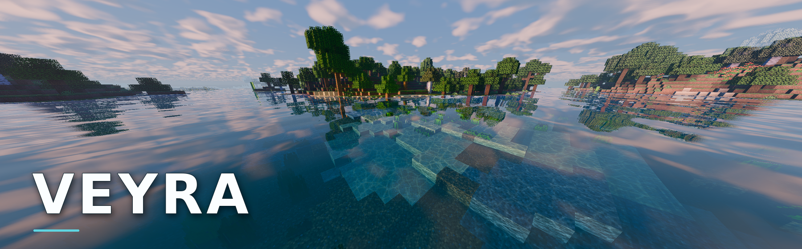
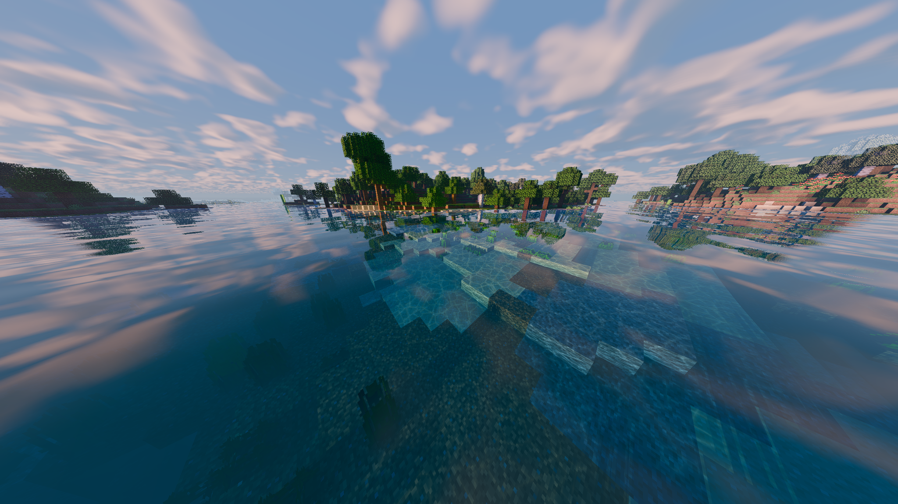
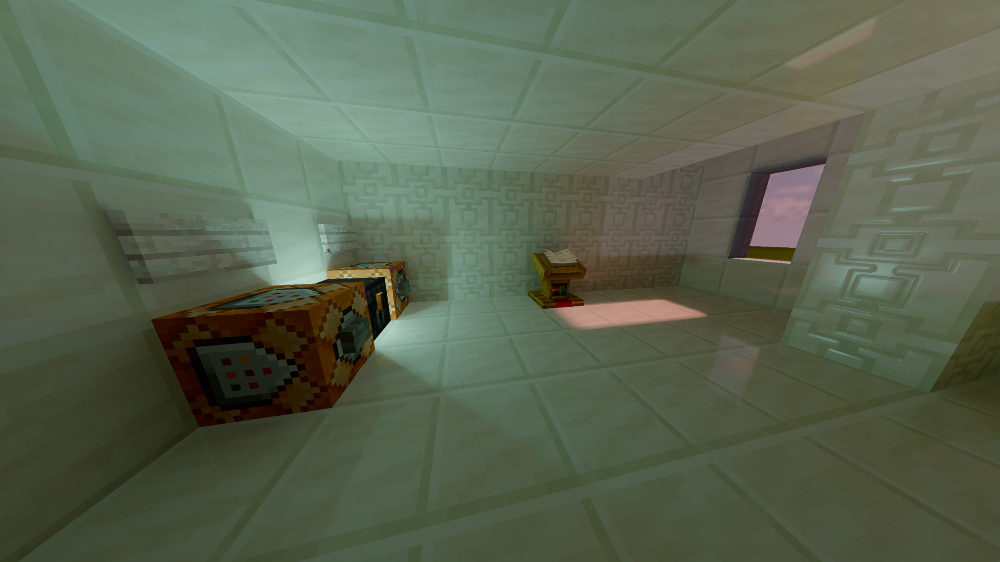
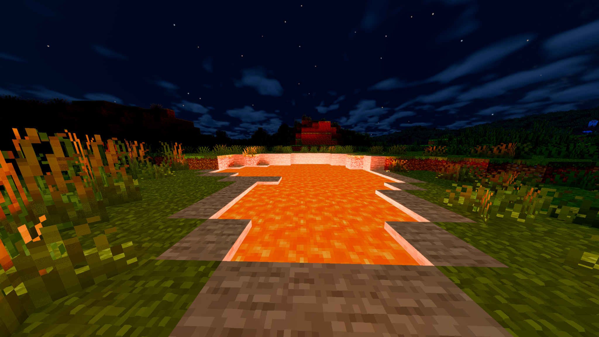
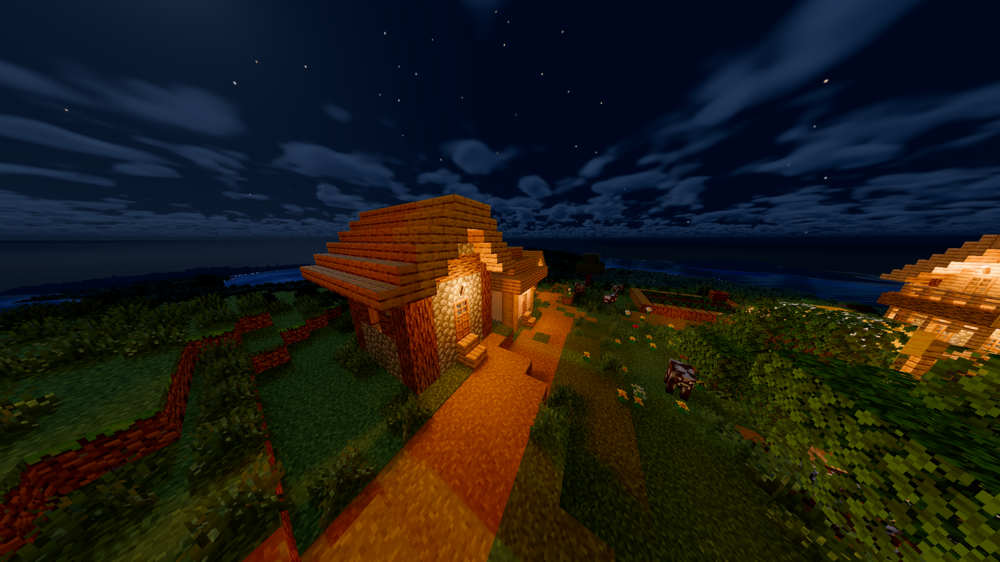
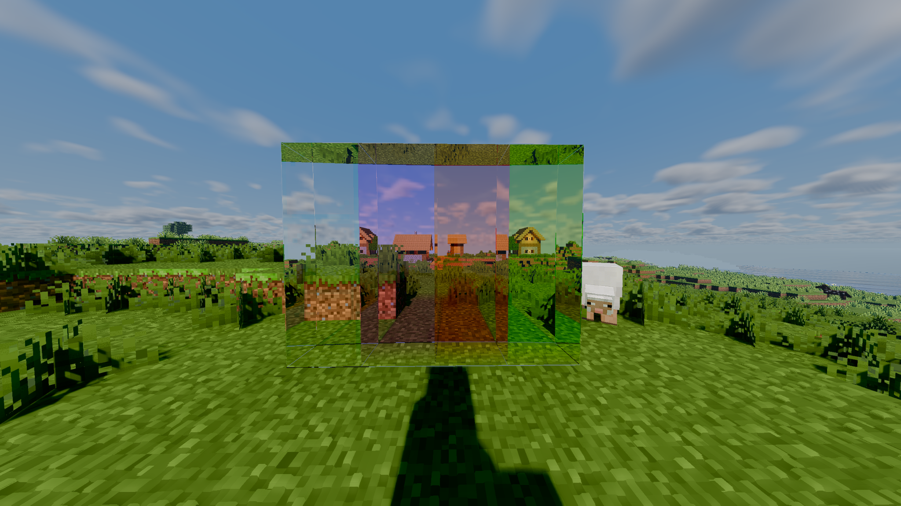

**Vulkan-based graphics for Minecraft Java Edition.**

> **In development · Closed alpha planned · Testers wanted**

Veyra is an independent Minecraft graphics project built around **modern rendering, performance, and future creator tools**. The current development build combines a native Vulkan renderer with experimental support for existing Iris/OptiFine-format shaderpacks.

**At a glance:** Native Vulkan rendering with hardware ray tracing · Existing shaderpacks through Vulkan · **FSR 3.1 upscaling for both native and Legacy rendering** · **Frame generation implemented for native rendering, with experimental Legacy support**.

The longer-term direction is a graphics platform where shader creators can build **Veyra-native shaders** and players can choose how to use their hardware — from advanced ray-traced effects to more conventional rendering.

## Project direction

Veyra's development has three main areas:

- **Rendering:** native ray-traced lighting, reflections, water, atmospheric effects, and physically based materials.
- **Performance:** flexible quality settings, optional upscaling and frame generation, and future work on rendering-pipeline efficiency. Broader engine-level optimization is a goal, not an existing feature.
- **Creator tools:** a planned Veyra-native shader path and tools for building and testing shaders with modern rendering features.

The intention is to improve the rendering technology and creator tools over time rather than treating the first release as a finished endpoint.

## Native renderer showcase

In-game screenshots of Veyra's native renderer.

## Development status

**Snapshot: 9 October 2026 · Internal development version: 0.15.0**

This section separates features already implemented and tested in development from experimental features, known issues, and longer-term plans.

### Implemented and tested in development

| Area | Current state |
| --- | --- |
| Native Vulkan renderer | Running with hybrid raster rendering and hardware ray-traced effects on the primary development PC. |
| Native lighting and effects | Ray-traced lighting, indirect illumination, shadows, reflections, water, glass, and atmospheric effects are implemented. |
| Graphics settings | Presets, custom settings, and a profiler are implemented. |
| Native resolution | Native rendering is available without upscaling or frame generation. |
| Upscaling | FSR 1 and FSR 3.1 reconstruction paths are implemented for native and Legacy rendering; FSR 3.1 has targeted GPU validation. |
| Materials | LabPBR/oldPBR support, material controls, and an optional experimental material preview are implemented. |
| Legacy shaderpacks | Selected existing shaderpacks launch, render, and remain playable in development tests. |

These results are primarily from **Windows x64 on an AMD Radeon RX 9070**, not a complete hardware compatibility test.

### Experimental or still being improved

| Area | What remains |
| --- | --- |
| Native image quality | Motion-related noise, some night/cave lighting artefacts, and foliage shimmer still need work. |
| Water and materials | Some scenes and material combinations still need in-game validation and refinement. |
| Legacy compatibility | Not all shaderpacks, settings, or visual effects match their behaviour in Iris. |
| Frame generation | Implemented and tested in native rendering. Legacy support remains experimental; motion data and presentation behaviour still need further validation. |
| Stability | Resourcepack reloads and shader-setting changes still need further validation. |
| Performance | Results vary by shaderpack and configuration; optimization and broader GPU testing are ongoing. |

### Not available yet / future development

- **Veyra-native shader authoring:** a dedicated shader format and creator tooling are planned but not released.
- **Rendering-pipeline optimization:** broader CPU/GPU efficiency work, such as improved geometry handling and culling, is a future development direction rather than a completed optimization layer.
- **Broad hardware validation:** support beyond the main development configuration has not yet been established.
- **DLSS and XeSS:** not implemented.
- **Public release:** no public build is available yet.

## Legacy shaderpacks: current test baseline

The following versions have been manually tested on the main development PC and reported to launch, render, and remain playable in normal gameplay.

| Shaderpack | Tested version |
| --- | --- |
| Complementary Unbound | r5.9.3 |
| Sildur's Vibrant Shaders | v2.02 Extreme-VL |
| MakeUp UltraFast | 9.5g |
| BSL | v10.1.8 |

Legacy packs can be run at **native resolution without frame generation or upscaling**. Optional reconstruction is implemented; Legacy frame generation is still experimental. A pack appearing in the table means it has a working test baseline, not that every option or scene is visually identical to Iris.

## Technical overview

- **Minecraft target:** Java Edition 26.3
- **Mod loader:** NeoForge 26.3.0.45-beta
- **Java:** 25
- **Graphics API:** Vulkan
- **Primary test hardware:** AMD Radeon RX 9070 on Windows x64
- **Rendering modes:** Legacy, No RT, Low RT, Hero, Ultra
- **Upscaling:** Off/native, FSR 1, FSR 3.1, Native AA
- **Frame generation:** implemented for native rendering; experimental in Legacy

The native renderer uses a hybrid approach, combining rasterized scene data with Vulkan hardware ray queries. Legacy mode is a separate rendering path for existing shaderpack formats.

## What comes next

The immediate focus is **rendering stability, visual quality, Legacy compatibility, and performance testing** across more configurations. Feedback from the closed alpha will help determine priorities.

Longer-term development is intended to cover efficient rendering, a Veyra-native shader system, and creator tools. These are development goals, not announced release commitments.

## Closed alpha — testers wanted

A small closed alpha is being prepared to gather feedback on image quality, shaderpack behaviour, stability, and performance on different hardware.

To register interest in alpha testing, join the Veyra Discord.

**[Join the Veyra Discord — Closed Alpha](https://discord.gg/aFFZhCYBSV)**

Testing places will be selected manually. There is no public download yet.

---

Veyra is an independent project and is not affiliated with Mojang Studios or Microsoft.
